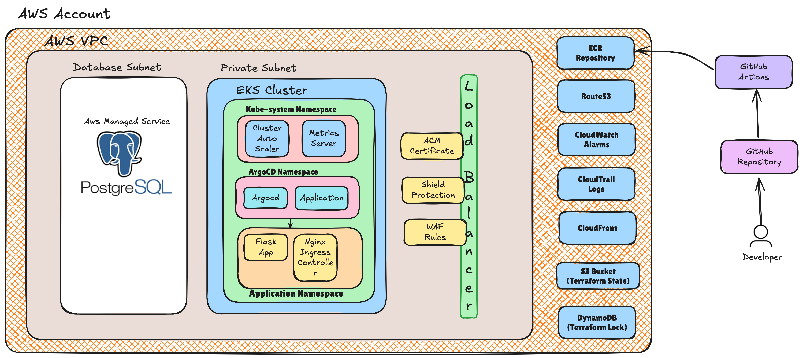

# Open Innovation Challenge

This project demonstrates the real-time implementation of application development, build, and release lifecycles using a CI/CD pipeline with modern DevOps tools and industry best practices.

## Architecture Overview



## Technology Stack

This repository includes the code to set up and deploy a Python Flask application using the following tools:

1. **Terraform** - To provision AWS resources, including the RDS Postgres Database, EKS Cluster, and Kubernetes resources on the EKS cluster.
2. **Docker** - For building and managing container images for the Flask application.
3. **AWS EKS** - For deploying and managing application containers.
4. **Kubernetes** - To orchestrate the deployment of containers.
5. **GitHub Actions** - For automating the CI/CD pipeline.
6. **Amazon ECR** - To store Docker images.
7. **AWS RDS** - To provision the Postgres Database using AWS managed services.
8. **Python Flask** - For creating a sample application that connects to the Postgres database and includes a sample frontend HTML page.
9. **kubectl** - To manage Kubernetes configurations.

## Solution

The infrastructure setup includes creating a VPC with public, private, and database subnets. The EKS Cluster and worker nodes are deployed in the private subnet to ensure security. Terraform is used to manage AWS resources such as IAM roles, security groups, and more.

The CI/CD pipeline is configured to:
- Run `terraform init`, `plan`, and `apply` when changes are detected in the `terraform` directory.
- Build and push Docker images to Amazon ECR when changes are made in the `python-flask` directory.
- Apply Kubernetes configurations using `kubectl` when changes occur in the `flask-app` directory.

## Cloud Infrastructure Platform

AWS is chosen for this project due to its robust services, scalability, and global reach. Key services include Elastic Kubernetes Service (EKS) for container orchestration and RDS for managed PostgreSQL databases.

## Orchestration Tools

Kubernetes is used for orchestrating containerized applications at scale. Key components include:
- **EKS**: Manages Kubernetes control plane and worker nodes.
- **Helm**: Simplifies Kubernetes application deployment with pre-configured charts.
- **Ingress Controller**: Manages external access to services within the cluster.

## Infrastructure Provisioning Tools and Methodologies

Terraform is used for infrastructure-as-code (IaC), enabling version control and repeatability. Below is a snippet for setting up an EKS cluster:

```hcl
provider "aws" {
  region = "eu-west-1"
}

module "eks" {
  source         = "terraform-aws-modules/eks/aws"
  cluster_name   = "challenge"
  cluster_version = "1.30"
  subnets        = ["subnet-12345678", "subnet-87654321"]
  vpc_id         = "vpc-12345678"
}
```

### Terraform Workspaces
We can further leverage the concepts like workspaces in terraform which can enable us to use the same codebase to create and manage different environments with different set of input variables. This will simplify the maintainability of the terraform code and eases the process of upgrades of providers and any code deprecations.

### Database Deployment

AWS Managed RDS with PostgreSQL is used to reduce operational overhead. Key features include:

1. Vulnerability patching
2. Automated minor version upgrades
3. Daily backups
4. High availability (Multi-AZ)
5. Simplified disaster recovery (DR) setup

## Releasing Microservices

GitHub Actions automates microservices deployment. Docker images are built and pushed to ECR, and Kubernetes manifests are applied to deploy services. Example workflow:

```yaml
name: Deploy to EKS
on:
  push:
    paths:
      - 'python-flask/'
jobs:
  build:
    runs-on: ubuntu-latest
    steps:
      - name: Checkout code
        uses: actions/checkout@v2
      - name: Log in to Amazon ECR
        uses: aws-actions/amazon-ecr-login@v1
      - name: Build and push Docker image
        run: |
          docker build -t $ECR_REGISTRY/$ECR_REPOSITORY:$IMAGE_TAG python-flask
          docker push $ECR_REGISTRY/$ECR_REPOSITORY:$IMAGE_TAG
  deploy:
    runs-on: ubuntu-latest
    needs: build
    steps:
      - name: Apply Kubernetes manifests
        run: kubectl apply -f flask-app
```

### GitOps Deployment Methodology
In the terraform code, we can notice the helm release deployment of the ArgoCD tool which enables us to follow the GitOps model for the automated deployments whenever there is a change in the target repository. This automates deployments to the cluster whenever changes are pushed to the target repository.

## Releases

The releases involve multiple stages:
1. **Development**: Feature branches are used for code changes. Peer reviews and pipelines are executed for building images and pushing them to ECR.
2. **Testing**: Automated unit tests are executed on pull requests. Merges are only allowed upon successful pipeline completion.
3. **User Acceptance Testing(UAT)**: Merges to the main branch trigger deployments to the UAT environment. Teams test use cases, user journeys, and integrations before signing off. 
4. **Production**: Approved changes are deployed to production. Canary releases can be used to validate changes on a small subset of traffic before full rollout. 

## Monitoring and Observability

### Monitoring
AWS CloudWatch and Prometheus are used for monitoring. CloudWatch tracks AWS resource metrics, while Prometheus monitors Kubernetes clusters. Alerts are configured with integration into on-call tools for anomaly detection.

### Application Performance Monitoring
Tools such as Jaeger, NewRelic, or Datadog provide APM metrics, helping teams identify and resolve latency issues.

### Observability
For the observability, we can leverage the stacks like AWS Managed OpenSearch(ElasticSearch) along with the services like FluentD/FluentBit deployed on the kubernetes cluster for centralized logging mechanism. Kibana will be used to access all these logs from a single portal.

## Prerequisites

Ensure the following prerequisites are met before executing the code:

1. Create a `credentials.txt` file in the `terraform` directory for AWS credentials.
2. Install Terraform, Docker, and kubectl.

## Implementation

Clone the repository and navigate to the `terraform` directory to initialize and apply the infrastructure setup:

1. Initialize Terraform
```shell
./run.sh init
```

2. Plan to check the expected output
```shell
./run.sh plan
```

3. Apply the changes
```shell
./run.sh apply --auto-approve
```

Once the infrastructure is set up, push changes to the `python-flask` and `flask-app` directories to trigger the GitHub Actions workflows.

### GitHub Actions Dependency

- Add AWS Access Key and Secret Key to the GitHub repository secrets to allow the GitHub runners to interact with AWS services.

## Build and Deployment

I have included a sample-workflow to demonstrate how we can enable the GitHub actions for this repository.

- **Terraform Workflow**: Initializes and applies infrastructure changes.
- **Docker Workflow**: Builds and pushes Docker images to ECR.
- **Kubernetes Workflow**: Applies Kubernetes configurations.

## Scalability Testing

To test the Horizontal Pod Autoscaler, use the following commands to generate load:

1. Create a deployment for the load-generator
```shell
kubectl run -i --tty load-generator --image=busybox /bin/sh
```

2. Script to spike CPU utilization from the busybox pod
```shell
while true; do wget -q -O- http://flask-app.svc.cluster.local; done
```

## Decommission

To clean up resources, run the following command:
```shell
./run.sh destroy --auto-approve
```

These steps can be repeated as needed to manage the infrastructure and application lifecycle.